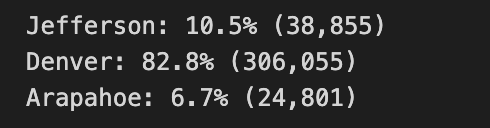
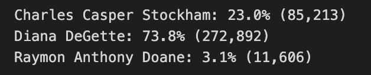

# Election_Analysis
Using python for election analysis 

## Overview of Election Audit 
The purpose of the election audit analysis is to use raw data given to examine the voter result for a congressional election in Colorado. We used the python and the information given in raw data from a csv file to figure out total number of votes, the total number of votes for each candidate, and the percentage of total votes each candidate won to figure out who won the election. We also used our information given to see how many of the votes were from Jefferson, Denver, and Arapahoe. From there, we could see which county had the largest turnout.  

## Election Audit Results
-The total number of votes cast in this congressional election is 369,711. 

-Jefferson county received around 38,855 votes making up 10.5 percent of the total votes, Denver around 306,055 votes making up 82.8 percent of the total votes, and Arapahoe received around 24,801 votes making up 6.7 percent of the total votes. 

-The county of Denver received the greatest number of votes.

-Charles Casper Stockham received 85,213 votes making up 23.0% of the total votes, Diana DeGette received 272,892 votes making up 73.8 % of the total votes, and Raymon Anthony Doane received 11.606 votes making up 3.1% of the total votes. 

-Diana DeGette received the most amount of votes and won this election. She received 272,892 votes, which is 73.8 % of the total votes. 

## Election Audit Summary 
This script can be used for any election, as long as the raw data provides a first column for voter ID information, the second column provides which county the voter is registered to vote, and the third column provides information on who they voted for. The number of rows of information does not matter when taking this script into account. This script can be modified but still be used for different elections. For example, we can change the county column and change it to state information, to make the script about analyzing a country wide election. Another example would be to change the county column to party affiliation (such as democrat, republican, or third party) to analyze how many voters voted for a specific party. 
